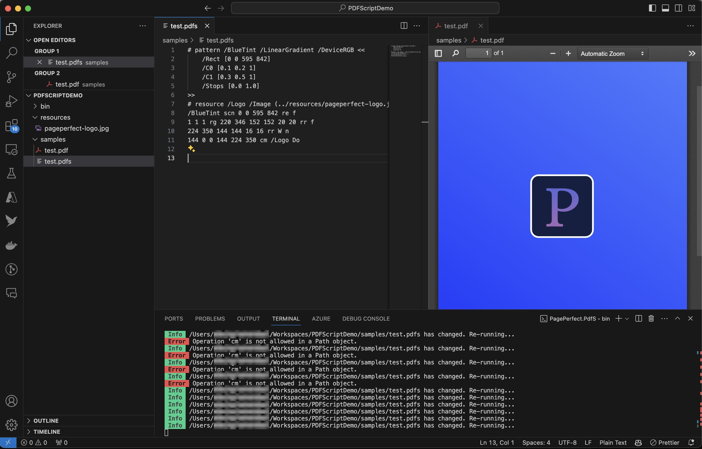
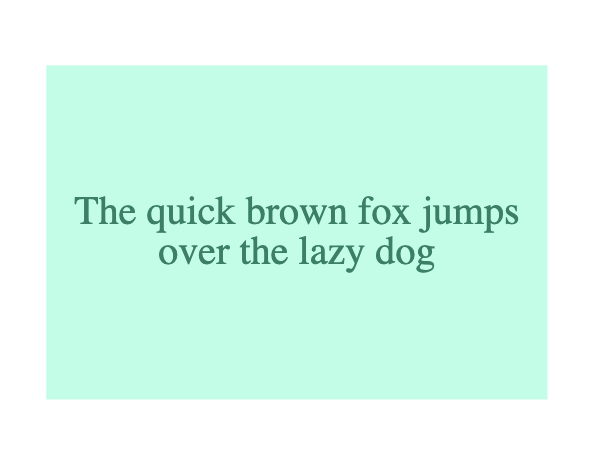

# PDFScript - a transpiler for PDF


## Latest release

Binaries at [Github Releases](https://github.com/PagePerfect-io/PDFScript/releases)

[](https://www.nuget.org/packages/PagePerfect.PdfScript/) `PagePerfect.PdfScript`

## Further reading

- [Syntax and structure](docs/syntax-and-structure.md)

- [Graphics operations](docs/graphics-operations.md)

## Introduction

PDFScript is a transpiler for PDF: an improved and simplified PDF-derived language to create good looking documents using low-level PDF graphics instructions and simplified resource management.

PDFScript lets you focus on the page content while it handles the plumbing of creating a PDF file.

You create a PDF Script in a `.pdfs` file, and produce a PDF via the CLI or via the .Net class library, from within your own project.

The following is a valid `.pdfs` file that produces a one-page document:

```
BT /TimesRoman 12 Tf 72 144 Td (Hello, World!) Tj ET
```

The syntax of this minimal file is identical to the syntax of the ‘content stream’ inside the generated PDF file. PDFScript handles the stuff around this content, including resources such as images and fonts.

## How to use PDFScript

### Command line utility or API

Use the `pdfs` CLI to process PDFScript from the command-line:

```
pdfs run document.pdfs output.pdf
```

Or use the .NET NuGet package to create PDFs from your .net project.

```
dotnet add package PagePerfect.PdfScript
```

```c#
using PagePerfect.PdfScript;

// Write a PDF document to a file on the local file system.
var  doc = new Document(“10 600 100 100 10 10 rr f”);
await doc.SaveAs(“Output.pdf”);

// Or, write a PDF document to a stream.
using var output = new MemoryStream();
var another = new Document("BT /TimesRoman 12 Tf 72 144 Td (Hello, World!) Tj ET");
await another.ToStream(output);
```

### Interactive writing with the CLI



Image: _Editing a .pdfs file in Visual Studio Code_

#### Watching for file changes

Using the `watch` command, te CLI can watch a file or directory for changes and re-process the PDFScript file when it changes.

To watch a single file:

```
pdfs watch document.pdfs output.pdf

```

To watch a directory:

```
pdfs watch directory
```

**Note:** The CLI will watch for changes to `.pdfs` files in the directory and its subdirectories, and will process them into PDF files in the same directory structure. Each output file will have a matching filename, but with the `.pdf` extension.

## Features

### Minimal PDF syntax

PDFScript takes care of the binary formatting of a PDF document. A `.pdfs` file is text file that can be typed up by a human, or easily generated by some code. There is no need to worry about binary representation, precise location of content inside the file, and other details that make generating PDFs a time-consuming task.

In fact a `.pdfs` file consists only of content. Even a multi-page document can be expressed without the need of a document structure:

```
BT 1 0 0 1 20 810 Tm /TimeRoman 12 Tf (Hello, World!) Tj ET
endpage
BT 1 0 0 1 20 810 Tm /TimeRoman 12 Tf (Hello, page two!) Tj ET
```

The graphics operators are the same as in a PDF file, and the syntax for expressing numbers, strings and so on is also the same. With a few exceptions, you can use a PDF reference to understand the syntax of a `.pdfs` file.

### Text file format

A `.pdfs` file is a UTF-8 encoded text file. This means you can use any text editor to write your PDFScript files. You can also generate `.pdfs` files using basic string writers in popular languages. The result of processing a `.pdfs` file is a binary PDF file.

### New graphics instructions

The PDF file format is 30 years old and yet not much has changed in its core set of content instructions. Common and popular features like rounded rectangles or gradient fills are either not available in the PDF specification, or hard to use. PDFScript contains instructions for these.

```
# pattern /Grad1 /LinearGradient /DeviceRGB <<
    /Rect [10 10 200 150]
    /C0 [1.0 0.2 0.8]
    /C2 [0.7 0.2 1.0]
    /Stops [0 1]
>>

/Grad1 scn
10 10 200 150 10 10 rr f
```

This produces a page with a rounded rectangle (the `rr` instruction), filled with a linear gradient brush named `/Grad1`.

### Syntax checking

PDF renderers do not tell you precisely where a document is invalid. They may stop rendering, or they may ignore invalid content. There is no developer experience when generating PDF documents.

When PDFScript parses a file with an invalid operand or unknown operation, it will stop processing and output an error onto the standard error output. For example, the `m` operation requires two numbers, and the following will produce an error:

```
(String) 10 m
```

### External resources

A PDF file contains all of the resources needed to render content. This means images and fonts are included inside of the PDF file, in their binary formats.

In addition, they need a lot of plumbing to work. Embedding a font in a PDF requires you include at least two sets of information about the font, and list the precise widths of its glyphs, and that’s before you get into character mappings, and making text selectable in PDF readers …

In a `.pdfs` file, you simply refer to the resources in the prologue, and then use them in your content with the usual PDF syntax.

```
# resource /Img1 /Image (https://coolimage.com)
# resource /MyRoboto /Font (../../fonts/Roboto-Regular.ttf)

320 0 0 320 10 450 /Img1 Do
BT /MyRoboto 12 Tf 1 0 0 1 10 430 Tm (Hello, Roboto!) Tj ET
```

PDFScript will take care of all of the necessary work to turn this into a valid PDF file. This includes embedding the image and the font, and figuring out how to handle the typeface.

**Note:** Currently only TrueType fonts (`.ttf`) and JPEG images are supported.

### Latin-1 and Unicode text

A `.pdfs` file is a UTF-8 text file. You can include ASCII characters and Latin-1 (ISO-8859-1) characters such as the Pound Sterling (£) symbol. These are converted to a format PDF can understand.

**Note:** Currently, Unicode characters are not supported in this version of PDFScript.

```
BT
1 0 0 1 10 800 Tm /TimesRoman 12 Tf
(Hello, £100 !) Tj
ET
```

### Variables and dynamic content

With PDFScript, you can substitute any operand for a variable instead. Define a variable in the prologue, and use it in place of any operand whose type matches.

```
# var $fontSize /Number 12
# var $hello /String (Hello, World!)

BT
/TimesRoman $fontSize Tf
$hello Tj
ET
```

### Flowing text

Flowing text is not possible in PDFs. They render text on one line, and it’s up to the creator to figure out how to flow the text across multiple lines.

PDFScript adds support for text-flowing. The `Tfl` operation is the text-flow macro. It uses a 'text box' containing rectangle and some state parameters, and flows text within the container.

```
1 0 0 1 72 300 cm
0.7 1 0.9 rg 0 0 300 200 re f
0.1 0.5 0.4 rg
BT
/TimesRoman 24 Tf
1 Ta 1 TA 300 200 Tb
(The quick brown fox jumps over the lazy dog) Tfl
ET
```



The `Ta` and `TA` operations set the alignment of the text. The `Tb` operation sets the text box. You can use the special value `/Auto` for the width or height of the text box if you do not want a fixed width or height.
